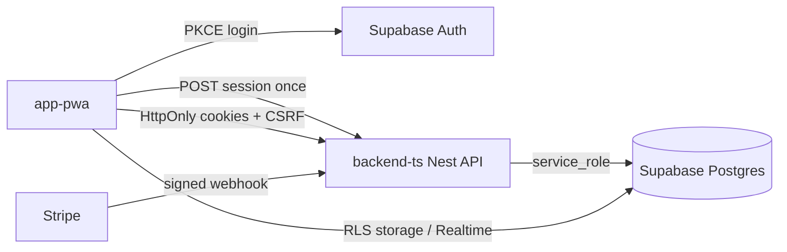

# JOBBIE security architecture

Developer onboarding: [README.md](./README.md) (doc hub), [auth-security.md](./auth-security.md) (sessions, roles, CSRF). This file is the production security checklist and endpoint template.

## Trust boundaries

The Nest API uses `SUPABASE_SERVICE_ROLE_KEY` and **must enforce authorization in code**. Row Level Security protects direct Supabase client access from the PWA, not API routes.

## Platform checklist (production)

| Control | Implementation |
|---------|----------------|
| HTTPS | TLS at CDN/LB; HSTS via Nest `helmet` + PWA `nitro.routeRules` |
| Session cookies | BFF `POST /api/auth/session` → `jb_at`, `jb_sid` (HttpOnly, Secure, SameSite=Lax) |
| CSRF | `jb_csrf` cookie + `X-CSRF-Token` on mutations |
| Security headers | `helmet` (API); CSP + X-Frame-Options etc. (PWA) |
| Secrets | `.env` only; see [database-operations-runbook.md](./database-operations-runbook.md#secret-rotation) |
| Authentication | `GlobalAuthGuard` (cookie or Bearer during transition); JWKS |
| Desktop admin | [`jobbie-admin/api`](../jobbie-admin/api) — `AppRoleGuard` + Bearer JWT; `@RequireRecentLogin()` on sensitive routes |
| Step-up | `@RequireRecentLogin()` — `api_user_sessions.last_step_up_at` within 15 min |
| Authorization | Ownership checks, `AppRoleGuard`, `PermissionsGuard` + scopes |
| Account status | `profiles.account_status` (`active` / `suspended` / `closed`); `AccountStatusGuard` |
| Input validation | Global `ValidationPipe`, DTOs |
| Password hashing | Supabase Auth |
| Rate limits | `@nestjs/throttler` + Supabase Auth dashboard limits |
| Failed login | `login_attempt_counters`, `auth_security_events`, Turnstile on failures |
| Credits ledger | `credit_ledger`, `credit_lots`; RPCs `grant_credits`, `spend_credits`, `reverse_spend_for_ref`, `expire_due_credit_lots` |
| Payments | Stripe signature + `stripe_credit_fulfillments` + pack validation; catalog from DB not client |
| HTML XSS | `sanitizeRichTextHtml` server-side |
| Storage | Nest `StorageModule` only (sniff MIME, sharp, random keys); Supabase buckets; chat signed URLs; see `.cursor/rules/security-storage.mdc` |
| Malware scan | `FileScanService` (ClamAV TCP when `CLAMAV_HOST` set); production defaults to **fail-closed** on scan errors (`CLAMAV_FAIL_OPEN` unset → false in prod) |
| Audit | `audit_events` HMAC chain; `AUDIT_CHAIN_SECRET` required in production |
| Abuse reports | `POST /api/reports` → `content_reports` |
| Admin enforcement | Desktop admin API `POST /api/admin/users/:id/suspend` / `unsuspend` + audit ([admin-desktop.md](./admin-desktop.md)) |
| Enumeration | Generic login/reset copy; CAPTCHA on failed login |
| Privacy / GDPR | CV unlock + visibility; address redaction; `consent_events`; `GET /profiles/me/export`; account delete — [GDPR-PRIVACY.md](./GDPR-PRIVACY.md) |

## BFF session flow

1. PWA signs in with Supabase (`signInWithPassword` / OAuth / MFA).
2. PWA calls `POST /api/auth/session` with `access_token`, `refresh_token`, optional `device_id`.
3. API validates JWT, stores hashed refresh in `api_user_sessions`, sets cookies.
4. Subsequent API calls use `credentials: 'include'`; no Bearer header to Nest.
5. Logout: `POST /api/auth/session/logout` revokes session row and clears cookies.

**Realtime:** Supabase client may keep access token in memory only (not `localStorage`) for channels.

**Storage uploads:** PWA must **not** call `supabase.storage.upload`. Use `POST /api/storage/uploads/init` + `uploadToSignedUrl` + `POST /api/storage/uploads/:id/finalize` (see [uploads.md](./uploads.md)). Deploy API before migrations that revoke client INSERT on `job-photos` / `profile-avatars`.

## Adding a new protected endpoint

1. Create a DTO with `class-validator` decorators.
2. Do **not** add `@Public()` unless the route is intentionally anonymous.
3. In the service, verify `user.id` owns the resource (or has admin scope).
4. For spend actions, call `CreditsService.spendAmount` with stable `refType` + `refId`; on failure after spend, `reverseSpendByRef`.
5. Add `@Throttle()` if the route is abuse-prone.
6. Call `audit.recordAuditEvent` for security- or billing-relevant mutations.
7. For billing, account delete, or admin moderation: add `@RequireRecentLogin()`.

## Credits & payments (detail)

- **Grant paths**: `StripeService.fulfillCreditsIfNeeded`, `SubscriptionCreditsService` (invoice + free cron), admin adjustments via `grant_credits` with `source = adjustment`.
- **Spend**: FIFO lots + advisory lock; idempotent per `(user_id, ref_type, ref_id)` for spends.
- **Rollback**: `reverse_spend_for_ref` after failed publish/activate when credits were already spent.
- **Webhooks**: `claimStripeWebhookEvent`; verify ledger on duplicate fulfillment or `subscription_period_credit_grants` insert.
- **Pricing**: Checkout uses server `price_id` from `credit_packs`; `CREDIT_COSTS` in TS for action prices only.
- See `.cursor/rules/security-billing.mdc` and migration `20260621153000_billing_rpc_idempotent_reverse.sql`.

## Supabase Auth rate limits

Configure in the Supabase project dashboard (Authentication → Rate Limits). These complement API throttles on `/api/auth/security/*`.

## CI

Run `scripts/security-check.sh` on PRs touching `backend-ts/`, `app-pwa/`, or `supabase/migrations/`.

## Cursor rules

- `.cursor/rules/security-platform.mdc` (always on)
- `.cursor/rules/security-backend.mdc`, `security-auth.mdc`, `database-engineering.mdc`
