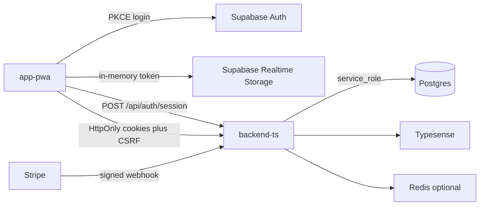

# Architecture

High-level structure of JOBBIE: Nuxt PWA, Nest API, Supabase Postgres, and optional Redis / Typesense / Stripe.

For security boundaries in depth, see [SECURITY.md](./SECURITY.md). For scaling patterns, see [scalability.md](./scalability.md).

## Trust boundaries

- **Nest API** uses `SUPABASE_SERVICE_ROLE_KEY` and bypasses RLS — authorization must be enforced in services/controllers.
- **RLS** still protects direct Supabase client access from the browser (anon key is public).
- **Business mutations** (credits, publish, billing) go through Nest, not client-side Supabase DML on ledger tables.

## Request flow (typical authenticated action)

1. User signs in via Supabase Auth in the PWA (PKCE).
2. PWA calls `POST /api/auth/session` with Supabase tokens → API sets `jb_at` / `jb_sid` / `jb_csrf` cookies.
3. PWA calls Nest with `credentials: 'include'` and `X-CSRF-Token` on mutations.
4. `GlobalAuthGuard` → `SessionAuthGuard` validates JWT from cookie (or Bearer during transition).
5. Controller/service checks ownership/roles, runs validation, may call `spend_credits` RPC via `CreditsService`.
6. Response DTO returned; PWA updates local `useState` / refetches lists.

Parallel path: Supabase Realtime/Socket.IO for chat and live feeds without routing all reads through Nest.

## Repository layout

See [README.md](./README.md#codebase-inventory) for the folder table.

## NestJS modules

Registered in [`backend-ts/src/app.module.ts`](../backend-ts/src/app.module.ts):

| Module | Responsibility |
|--------|----------------|
| `AuthModule` | JWT/session, guards, login security, admin users |
| `ProfilesModule` | Profile CRUD, GDPR export/delete |
| `JobsModule` | Job offers, publish/renew, listing expiry cron |
| `CompanyAdsModule` | Company/service ads |
| `ApplicationsModule` | Applications, employer applicants, CV database API |
| `ChatModule` | Rooms, messages, media upload, Socket.IO |
| `BillingModule` | Credits RPC wrapper, catalog, expiration cron |
| `PaymentsModule` | Stripe checkout, webhooks, subscription credits |
| `SearchModule` | Typesense, saved-search alert cron, BullMQ consumer |
| `JobAlertsModule` | Email job alerts cron |
| `NotificationsModule` | In-app notifications, push, SMS, digest crons |
| `CvModule` | CV CRUD, PDF, photo upload |
| `StorageModule` | Image upload pipeline to Supabase Storage |
| `AuditModule` | Audit chain, moderation, content reports, retention |
| `AnalyticsModule` / `AdminAnalyticsModule` | Dashboards |
| `MaintenanceModule` | Device session purge, ad expiry, orphan storage |
| `EmailModule` | SMTP / nodemailer (global) |
| `NewsletterModule` | MailerLite subscribe + retry cron |
| `ConsentModule` | `consent_events` |
| `DataExportModule` | ZIP export builder |
| `SupabaseModule` | Service-role client (+ optional read URL) |
| `RedisModule` | Optional Redis + catalog cache |
| `RealtimeModule` | Socket.IO helper |
| `MetricsModule` | Web vitals ingest, Prometheus `/metrics` |

Global guards: `ThrottlerGuard`, `GlobalAuthGuard`. Global filter: `SentryGlobalFilter`.

**Note:** `CvModule` uses `cv.dto.ts`, `cv.module.ts`, `cv-skill-name.ts`; `CvService` and HTTP controllers still ship as compiled `.js` in `src/cv/` (tracked in git) pending a full TypeScript port of those large files.

## PWA routing (overview)

| Prefix | Purpose |
|--------|---------|
| `/` | Redirect to `/app` when authenticated |
| `/app/*` | Main product (jobs, firmy, chat, profile, credits) |
| `/auth/*` | Login, register wizard, MFA, OAuth callback, password reset |
| `/nastavenia/*` | Settings |
| `/dashboard/*` | Role-specific dashboards |
| Desktop `jobbie-admin/` | Admin analytics, moderation, audit (not in public PWA) |
| `/cennik`, `/ponuky-na-email/*` | Marketing / alerts (some public) |
| `/preferences/[token]`, `/unsubscribe/[token]` | Token-based public prefs |

Layouts: `layouts/app.vue` (main nav), `layouts/default.vue` (minimal). Middleware: `auth`, `admin`, `customer-only`, `worker-only`, `provider-only`, dashboard variants — see [frontend.md](./frontend.md).

## Background jobs

### BullMQ (`background` queue)

When `REDIS_URL` is set, [`background-jobs.consumer.ts`](../backend-ts/src/search/background-jobs.consumer.ts) processes:

| Job name | Handler |
|----------|---------|
| `search-alerts` | Saved-search email dispatch |
| `job-email-alerts` | Job email alert dispatch |
| `typesense-reindex-chunk` | Typesense job reindex chunk |
| `reports`, `exports` | Placeholders (logged only) |

Without Redis, the same work runs **inline** from crons.

### Cron schedules

| Schedule | File | Purpose |
|----------|------|---------|
| `*/15 * * * *` | `search/search-alerts.cron.ts` | Saved-search alerts |
| `*/15 * * * *` | `job-alerts/job-email-alerts.cron.ts` | Job email alerts |
| `5 * * * *` | `jobs/job-listing-expiry.cron.ts` | Deactivate expired jobs |
| `30 5 * * *` | `billing/credit-expiration.cron.ts` | Expire credit lots |
| `15 6 1 * *` | `payments/subscription-monthly-credits.cron.ts` | Free-plan monthly credits |
| `0 8 * * 1` | `notifications/notification-jobs.service.ts` | Weekly digest email *(disabled — stub)* |
| Daily 11:00 | `notification-jobs.service.ts` | Re-engagement email |
| `EVERY_DAY_AT_3AM` | `audit/audit-retention.service.ts` | Purge old audit rows |
| `25 */2 * * *` | `newsletter/mailerlite-retry.cron.ts` | MailerLite retry |
| `0 4 * * 0` | `maintenance/maintenance.cron.ts` | Purge stale device sessions |
| `15 * * * *` | `maintenance/maintenance.cron.ts` | Expire company/banner ads |
| `0 5 * * 0` | `maintenance/maintenance.cron.ts` | Orphan storage cleanup |

Credit grants and Stripe fulfillment are **not** queued — synchronous + idempotent RPCs only.

## Important data flows

### Publish job offer

1. Create/update draft via `JobsService` (authenticated, company owner).
2. `assertCanPublish` — subscription active-offer limits (`SubscriptionLimitsService`).
3. `CreditsService.spendByKey` — e.g. `publishJob30Days` (see [payments-credits.md](./payments-credits.md)).
4. Activate listing (status, `ends_at`).
5. On failure after spend → `reverseSpendByRef`.

### Stripe credit purchase

1. Client starts checkout / PaymentIntent with server-resolved Stripe Price from `credit_packs`.
2. Webhook `POST /api/payments/webhook` — signature verified, event claimed in `stripe_webhook_events`.
3. `stripe_credit_fulfillments` insert (PK on `payment_intent_id`) then `grant_credits` RPC.

### Job email alert

1. Cron or BullMQ loads due `job_email_alerts`.
2. Match jobs (Typesense/SQL), send via `EmailService` (SMTP).
3. Record `job_email_alert_sent_jobs`; respect notification prefs and unsubscribe tokens.

### Chat message

1. Client sends via Socket.IO or REST (encrypted content at rest if `CHAT_CONTENT_ENCRYPTION_KEY` set).
2. In-app `user_notifications` + optional push (VAPID).
3. Chat attachments: upload to `chat-media` bucket, download via signed URL.

## Known risks and TODOs

| Risk | Mitigation |
|------|------------|
| Service role bypasses RLS | Ownership/role checks in every Nest service |
| Multi-instance Socket.IO | Set `REDIS_URL` for Redis adapter |
| Public anon key in PWA | Strict RLS; no client DML on ledger/audit |
| Bearer fallback in `useApi` | Prefer cookies after session bootstrap |

- **TODO: verify** whether [`supabase/full_schema_for_empty_supabase.sql`](../supabase/full_schema_for_empty_supabase.sql) is regenerated from migrations.
- **TODO: verify** Supabase CLI `config.toml` location (not present under `supabase/` in repo).

## How to modify safely

1. New HTTP surface → follow [SECURITY.md](./SECURITY.md#adding-a-new-protected-endpoint).
2. New tables → migration + RLS per [database-schema-conventions.md](./database-schema-conventions.md).
3. New list endpoint → pagination + indexes per [scalability.md](./scalability.md).
4. Credit-consuming feature → [payments-credits.md](./payments-credits.md) and `.cursor/rules/security-billing.mdc`.
