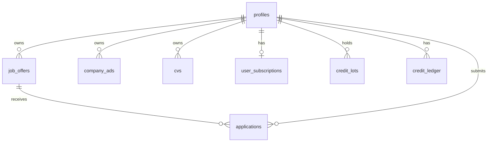

# Database

JOBBIE uses **Supabase Postgres** with SQL migrations, Row Level Security (RLS), and **service-role-only** RPCs for credits and billing.

Deep conventions: [database-schema-conventions.md](./database-schema-conventions.md). Operations: [database-operations-runbook.md](./database-operations-runbook.md).

## Provider and migrations

| Item | Detail |
|------|--------|
| Provider | Supabase (PostgreSQL) |
| Migrations | [`supabase/migrations/`](../supabase/migrations/) — **77** files (as of doc creation) |
| Naming | `YYYYMMDDHHMMSS_description.sql` |
| Apply order | Lexicographic by timestamp; staging before production |
| ORM | None — raw SQL migrations + Supabase JS client from Nest |

**TODO: verify** whether [`supabase/full_schema_for_empty_supabase.sql`](../supabase/full_schema_for_empty_supabase.sql) is regenerated when migrations change.

**TODO: verify** local Supabase CLI `config.toml` location (not under `supabase/` in this repo).

## Main domains and tables

### Jobs and applications

| Table / view | Purpose |
|--------------|---------|
| `job_offers` | Employer job listings (draft/active, credits, location, compensation) |
| `job_offers_public` | Public catalog view — redacted addresses/contacts |
| `applications` | Candidate applications per job (`pending`, `reviewing`, `interview_invited`, `rejected`, `accepted`, `withdrawn`) |
| `application_status_history` | Applicant status timeline |
| `application_notes` | Company-only internal notes per application |
| `job_applicant_reply_settings` | Per-job auto-reply templates (rejection / interview) |
| `company_applicant_message_templates` | Company-default auto-reply message bodies |
| `application_auto_messages` | Auto-reply idempotency log (channel, subject, body) |
| `job_views`, `job_impressions`, `saved_jobs` | Engagement and saves |
| `job_promotions` | Paid promotion slots (service-only DML) |

### Company ads

| Table / view | Purpose |
|--------------|---------|
| `company_ads` | Service/company profile ads |
| `company_ads_public` | Public catalog view |

### Profiles and auth-adjacent

| Table | Purpose |
|-------|---------|
| `profiles` | User row (`id` = `auth.users.id`), role, credits balance, privacy, billing jsonb |
| `user_subscriptions` | Stripe subscription link, plan slug |
| `login_attempt_counters`, `auth_security_events` | Abuse tracking |
| `api_user_sessions` | BFF refresh session hashes |
| `user_device_sessions` | Device/session hygiene |

### CVs

| Table | Purpose |
|-------|---------|
| `cvs` | CV documents per user (multi-CV) |
| `cv_personal_info` | PII — restricted column grants for `authenticated` |
| `cv_*` child tables | Experience, education, skills, references, etc. |

**TODO: verify** full list of `cv_*` section tables in migrations after `20260525100000_cv_multi_cvs_normalize.sql`.

### Chat and notifications storage

| Table | Purpose |
|-------|---------|
| `chat_rooms`, `chat_messages` | Messaging (optional E2EE fields) |
| `user_notifications` | In-app notification feed |
| `push_subscriptions` | Web push endpoints (deny-all RLS for clients) |
| `job_email_alerts`, `job_email_alert_sent_jobs` | Email alert config and dedupe |

### Marketing

| Table | Purpose |
|-------|---------|
| `subscribers` | Newsletter signups (service_role only) |
| `blog_posts` | Marketing blog articles (`status` draft/published; public read via Nest) |

### Billing and credits

| Table | Purpose |
|-------|---------|
| `profiles.credits` | Denormalized balance — **only** updated inside RPCs |
| `credit_lots` | FIFO inventory with optional `expires_at` |
| `credit_ledger` | Append-only history |
| `credit_packs` | One-off purchase catalog (+ `stripe_price_id`) |
| `subscription_plans` | Monthly plans (+ `max_active_jobs`, `monthly_credits`) |
| `subscription_period_credit_grants` | Idempotent monthly grant log |
| `stripe_credit_fulfillments` | PK `payment_intent_id` — double-grant prevention |
| `stripe_webhook_events`, `stripe_financial_events` | Webhook processing and refunds |
| `cv_contact_unlocks` | Employer paid unlock per CV |
| `banner_ads` | Banner placements |

### Audit and compliance

| Table | Purpose |
|-------|---------|
| `audit_events`, `audit_chain_state` | HMAC-chained audit log |
| `consent_events` | GDPR consent history (service insert) |
| `content_reports` | User abuse reports (`target_type`: `job_offer`, `company_profile`, `company_ad`, `banner_ad`, `company_review`, `chat_message`; service_role only) |

## Relationships (simplified)

Foreign keys generally reference `profiles(id)` or parent entities (`job_offers`, `cvs`, `chat_rooms`). See migrations for `ON DELETE` behavior per table.

## RLS patterns

| Pattern | Example |
|---------|---------|
| Owner row | `profiles`: `auth.uid() = id` |
| Participant | `chat_messages`, `applications` — company or applicant |
| Public read via views | `job_offers_public`, `company_ads_public`; base tables revoked from `anon` where applicable |
| Deny-all + service_role | `credit_ledger`, `audit_events`, `stripe_credit_fulfillments` |
| Column-level privacy | `cv_personal_info` — contact columns revoked from broad roles |
| Storage policies | Path must include `auth.uid()` for user buckets |

Nest uses **service_role** and bypasses RLS — policies protect direct PostgREST/client access.

Cursor rule: [`.cursor/rules/supabase-rls.mdc`](../.cursor/rules/supabase-rls.mdc).

## Credit ledger RPCs

Latest definitions: [`20260621153000_billing_rpc_idempotent_reverse.sql`](../supabase/migrations/20260621153000_billing_rpc_idempotent_reverse.sql).

| RPC | Grant | Purpose |
|-----|-------|---------|
| `grant_credits` | `service_role` | Add lot + ledger row; idempotent on Stripe IDs |
| `spend_credits` | `service_role` | FIFO spend; advisory lock; idempotent per `(user_id, ref_type, ref_id)` |
| `expire_due_credit_lots` | `service_role` | Cron expiration |
| `reverse_spend_for_ref` | `service_role` | Compensating grant after failed publish |
| `revoke_credits_for_payment_refund` | `service_role` | Refund clawback |

Nest entry point: [`CreditsService`](../backend-ts/src/billing/credits.service.ts).

## Transactions

- RPCs run in Postgres transactions with advisory locks for spend/grant consistency.
- Application-level “publish” flows: spend → DB update → reverse on failure (Nest), not a single cross-service 2PC.

## Indexes

- Partial uniques on Stripe IDs (`payment_intent_id`, `stripe_invoice_id`).
- Spend idempotency: `idx_credit_ledger_spend_ref_unique`.
- List/catalog: see `20260621153000_scalability_indexes.sql` and [database-schema-conventions.md](./database-schema-conventions.md).

## Data retention

- Audit: configurable retention via `AUDIT_RETENTION_*` env vars (see [database-operations-runbook.md](./database-operations-runbook.md)).
- **Engagement:** `job_impressions` — one row per `(user_id, job_id)`; Nest upserts via `POST /api/jobs/impressions`; daily purge by `shown_at` using `ENGAGEMENT_RETENTION_DAYS` (default 90). Employer job stats count **unique users** with `shown_at` in the selected period.
- **Search analytics:** `search_query_logs` purged with telemetry (`AUDIT_RETENTION_TELEMETRY_DAYS`).
- Account delete: soft-delete profile, hide CVs, deactivate alerts — [GDPR-PRIVACY.md](./GDPR-PRIVACY.md).
- Financial ledger: retained per compliance notes in GDPR doc (not wiped on delete).

## How to modify safely

1. New table → migration + RLS + grants in same PR; classify as catalog / user-owned / service-only.
2. Balance change → new or existing RPC only; never `UPDATE profiles SET credits = …` from app code.
3. New filter on large table → btree/GIN index in the same migration.
4. Public catalog column → update `*_public` view and Nest public mappers together.

Update [changelog.md](./changelog.md) for schema changes.
