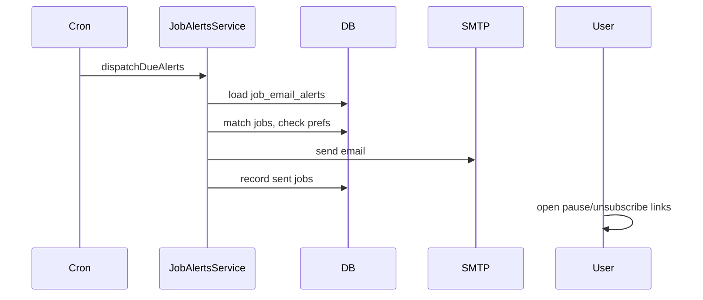

# Notifications

JOBBIE delivers notifications through in-app feed, email, and web push. SMS is not offered. Preferences and GDPR categories are documented in [GDPR-PRIVACY.md](./GDPR-PRIVACY.md).

## Channels overview

| Channel | Provider | Primary use |
|---------|----------|-------------|
| In-app | Postgres `user_notifications` | Chat, applications, system |
| Email | SMTP via [`EmailService`](../backend-ts/src/email/email.service.ts) (`nodemailer`) | Job alerts, saved searches, digests |
| Web Push | VAPID + service worker | Real-time engagement |

## In-app notifications

| Item | Detail |
|------|--------|
| **Table** | `user_notifications` |
| **PWA** | [`useNotifications()`](../app-pwa/composables/useNotifications.ts), `AppNotificationBell` |
| **API** | [`notifications.controller.ts`](../backend-ts/src/notifications/notifications.controller.ts) |
| **Types** | Initially `chat_message`, `job_application` (see migration `20260403100000_user_notifications.sql`) |

Unread counts and mark-read flow via Nest API (not client-side Supabase DML on deny-all tables).

## Email notifications

### Transactional / product email (SMTP)

| Flow | Trigger | Backend |
|------|---------|---------|
| Job email alerts | Cron `*/15` or BullMQ `job-email-alerts` | [`JobAlertsService`](../backend-ts/src/job-alerts/job-alerts.service.ts) |
| Saved search alerts | Cron `*/15` or BullMQ `search-alerts` | [`SearchAlertsService`](../backend-ts/src/search/search-alerts.service.ts) |
| Weekly digest | Monday 08:00 | [`NotificationJobsService`](../backend-ts/src/notifications/notification-jobs.service.ts) |
| Re-engagement | Daily 11:00 | `NotificationJobsService` |

Requires `SMTP_HOST`, `SMTP_FROM` (see [email-smtp.md](./email-smtp.md)). Links use `PUBLIC_APP_URL` / `PUBLIC_APP_ORIGIN`.

### Job alert emails (ponuky na e-mail)

- Config: `job_email_alerts` per user (filters + frequency: **daily**, **weekly**, **monthly**).
- **One summary email per alert per period** — all new matching active jobs since the last **successful** digest (`last_dispatch_at`), not one mail per job.
- `last_dispatch_at` updates only after SMTP success **and** `job_email_alert_sent_jobs` insert; empty periods send nothing and do not advance the watermark.
- Dedupe: `job_email_alert_sent_jobs` (per job_id) plus `created_at_ts` window (`last_dispatch_at` minus 120s overlap → run time).
- Must include per-alert pause and category unsubscribe links (transactional category `job_email_alerts`).
- Public token endpoints: `public/job-alerts` controller.

PWA: [`useJobEmailAlerts`](../app-pwa/composables/useJobEmailAlerts.ts), pages under `/ponuky-na-email/`. Wizard step 2 includes **Výhody** (`benefits` int[], stable IDs in [`job-alert-options.ts`](../app-pwa/utils/job-alert-options.ts)) via searchable multi-select [`AppIdLabelMultiCombobox`](../app-pwa/components/AppIdLabelMultiCombobox.vue); matching requires jobs to include **all** selected benefit IDs (`benefitsAll` in Typesense).

Preview count (`POST /api/job-alerts/preview-count`) uses [`JobAlertsMatchingService`](../backend-ts/src/job-alerts/job-alerts-matching.service.ts) with Typesense **`sort: relevance`** (same refinement as `/api/search`), then Postgres hydrate (`is_active`, not draft, not expired). The wizard number matches jobs visible on `/pracovne-ponuky`, not raw Typesense `found`.

Scheduled digest dispatch uses **`sort: created_at`** and `matchPublicJobIdsForDispatch` (up to 50 jobs per email) so the time window is filled chronologically.

Digest HTML uses the shared JOBBIE transactional layout ([`job-alert-digest-email.template.ts`](../backend-ts/src/email/job-alert-digest-email.template.ts)): mint header, soft job cards, green CTA, pause/unsubscribe footer.

### Marketing email

- Requires `marketing_processing_consent` and channel prefs.
- Newsletter: `POST /api/subscribe` → `subscribers` + MailerLite ([`newsletter/`](../backend-ts/src/newsletter/)).
- Unsubscribe: `/unsubscribe/[token]` with signed token (`NOTIFICATION_PREFERENCE_TOKEN_SECRET`).

## Web push

| Item | Detail |
|------|--------|
| **Backend** | [`PushNotificationService`](../backend-ts/src/notifications/push-notification.service.ts) |
| **Env** | `VAPID_PUBLIC_KEY`, `VAPID_PRIVATE_KEY`, `VAPID_SUBJECT` |
| **PWA** | [`useWebPushRegistration`](../app-pwa/composables/useWebPushRegistration.ts), [`service-worker/sw.ts`](../app-pwa/service-worker/sw.ts) |
| **Table** | `push_subscriptions` (service_role only) |
| **Chat socket** | `join_room` / `leave_room` on [`ChatGateway`](../backend-ts/src/chat/chat.gateway.ts); recipient must not stay in `chat:{roomId}` after leaving the room UI or push/email for that chat is skipped |

Registration: `/nastavenia/notifikacie` → **Povoliť push v prehliadači** (HTTPS + active service worker). Re-sync runs on login, tab focus (`visibilitychange`), service worker update (`controllerchange`), and `pushsubscriptionchange` (SW → client message).

Stale endpoints (410/404/401/403) are deleted from `push_subscriptions`; API logs `webpush failed … host=… status=…` (endpoint host only).

### Production verification (Windows / macOS)

1. After enable, confirm a row in `push_subscriptions` for the user (`user_id`, `endpoint`).
2. **Closed tab:** recipient closes all JOBBIE tabs; sender posts chat → OS notification should appear (category `messages`, push on).
3. **Open tab, left chat:** recipient opens `/chat/:id`, navigates to `/`; sender posts in that room → push should appear (requires `leave_room` on navigate away).
4. API logs: no recurring `webpush failed` for that user; `VAPID_*` set in deployment env.
5. OS/browser: site notifications allowed; Windows Focus Assist / macOS Focus off for the browser; Safari macOS 13+ (installed PWA recommended).

## Notification preferences

| Mechanism | Detail |
|-----------|--------|
| Profile JSON | `profiles.notification_preferences` |
| Authenticated API | `notifications` controller — update prefs |
| Public token | `GET/PATCH public/notification-preferences` with signed token |
| Consent log | `consent_events` via [`ConsentEventsService`](../backend-ts/src/consent/consent-events.service.ts) |

PWA settings: `/nastavenia/notifikacie` (and related privacy pages).

Valid unsubscribe categories must include `job_email_alerts` when adding new notification types — see [GDPR-PRIVACY.md](./GDPR-PRIVACY.md).

## Background scheduling

| Job | Schedule | Queue name |
|-----|----------|------------|
| Job email alerts | Every 15 min | `job-email-alerts` |
| Saved search alerts | Every 15 min | `search-alerts` |
| Weekly digest | Mon 08:00 | Inline cron |
| Re-engagement | Daily 11:00 | Inline cron |
| MailerLite retry | Every 2h at :25 | Inline cron |

With `REDIS_URL`, alert jobs enqueue to BullMQ `background` queue; otherwise run inline in cron handlers.

## Data flow (job alert email)

## How to modify safely

1. New notification category → GDPR doc, unsubscribe page validation, consent logging if marketing.
2. New email type → HTML in service via `EmailService.sendHtmlEmail`; throttle and audit if abuse-prone.
3. Do not insert `user_notifications` from the PWA via Supabase client.
4. Update [changelog.md](./changelog.md).
