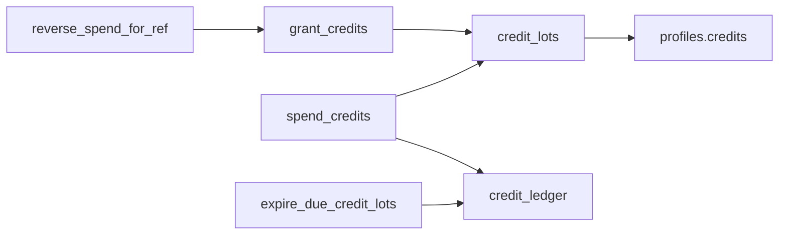

# Payments and credits


JOBBIE uses a **credit economy**: users buy credit packs or receive credits from subscriptions, then spend credits to publish, renew, promote listings, and use employer CV features. Stripe handles payments; Postgres RPCs maintain the ledger.


Cursor rule: [`.cursor/rules/security-billing.mdc`](../.cursor/rules/security-billing.mdc).


## Source of truth


| Concern | Source |

|---------|--------|

| Pack & plan **prices** (Stripe) | Postgres `credit_packs`, `subscription_plans` + `stripe_price_id` |

| Pack/plan **marketing specs** (dev alignment) | [`billing.config.ts`](../backend-ts/src/billing/billing.config.ts) — `CREDIT_PACKAGES`, `SUBSCRIPTION_PLAN_SPECS` |

| **Spend costs** (actions) | `CREDIT_COSTS` in `billing.config.ts` only |

| Public catalog API | `GET /api/billing/config` via [`BillingCatalogService`](../backend-ts/src/billing/billing-catalog.service.ts) |


Do not trust client-sent credit amounts or arbitrary Stripe price IDs at checkout.


## Credit packages (`credit_packs`)


Seeded slugs (align with `CREDIT_PACKAGES` in config):


| Slug | Credits (config) | Price (config) |

|------|------------------|----------------|

| `starter` | 5 | €5.00 |

| `popular` | 12 | €10.00 |

| `value` | 30 | €20.00 |

| `firmy` | 75 | €45.00 |


The legacy `agentura` pack is deactivated in DB (`active = false`). Stripe Price IDs are set per environment in the database — **TODO: verify** all rows have `stripe_price_id` in production.


## Subscription plans (`subscription_plans`)


| Slug | Monthly price (config) | Monthly credits | Max active offers |

|------|------------------------|-----------------|-------------------|

| `zadarmo` | €0 | 5 | 1 |

| `start` | €4.99 | 10 | 3 |

| `plus` | €9.99 | 25 | 6 |

| `pro` | €19.99 | 60 | 15 |


Paid plans: credit rollover up to **60 days** (`PAID_SUBSCRIPTION_CREDIT_ROLLOVER_DAYS`). Purchased pack credits do not expire.


Legacy slug mapping: `basic`→`start`, `standard`→`plus`, `premium`→`pro`. The `agentura` plan is hidden from public catalog (`active = false`); existing subscribers keep unlimited CV quotas via [`CvDatabaseQuotaService`](../backend-ts/src/billing/cv-database-quota.service.ts).


## CV database quotas (`subscription_plans` + `employer_cv_monthly_usage`)


| Plan | Included / month (unlock · contact · CV view/PDF) | After quota |

|------|-------------------------------------------|-------------|

| `zadarmo` | 10 · 5 · 5 | Rejected (`403`) — upgrade or wait for next month |

| `start` | 50 · 25 · 25 | Rejected (`403`) |

| `plus` | 75 · 50 · 50 | Rejected (`403`) |

| `pro` | Unlimited (`null` in DB) | — |


Enforced in [`CvDatabaseQuotaService`](../backend-ts/src/billing/cv-database-quota.service.ts) on unlock, open-chat (contact), and CV database **detail view** + **PDF** (`GET /api/employer/cv-database/:cvId` and `…/pdf`) — one quota unit per distinct CV per calendar month (`employer_cv_monthly_pdf_access`). Applicant CV PDF (`GET /api/employer/applications/:applicationId/cv/pdf`, bulk ZIP) does **not** consume this quota. Over-quota actions do **not** spend credits.


## Credit usage costs (`CREDIT_COSTS`)


### Plan-tier costs (enforced)

Source: [`plan-tier-credit-costs.ts`](../backend-ts/src/billing/plan-tier-credit-costs.ts). Exposed on `GET /api/billing/config` as `planTierCreditCosts`. Job publish/renew and `top_category` promotion use `CreditsService.spendForPlanTier`; **0 credits** skips `spend_credits` (Plus/Pro urgent publish, Pro top listing).

| Action | Zadarmo | Štart | Plus | Pro |
|--------|---------|-------|------|-----|
| Job publish | 3 | 3 | 3 | 3 |
| Service ad (Profesionáli) / month | 3 | 3 | 3 | 3 |
| Urgent job publish | 2 | 2 | 0 | 0 |
| Topovanie (`top_category`, 7 dní) | 10 | 10 | 5 | 0 |

Service profile multi-month publish: `publishCostCredits(months)` = 3 × months (max 12) on all tiers.

### Flat `CREDIT_COSTS` (other promote types)

From [`billing.config.ts`](../backend-ts/src/billing/billing.config.ts) — fallback when not plan-tier:

| Key | Cost |
|-----|------|
| `publishJob30Days` | 3 (tier overrides publish/renew) |
| `publishUrgentJob30Days` | 3 (tier overrides urgent publish) |
| `renewJob30Days` | 3 |
| `renewUrgentJob30Days` | 3 |
| `publishServiceProfile30Days` | 3 |
| `renewServiceProfile30Days` | 3 |
| `urgentBadge7Days` | 2 |
| `highlightedCard7Days` | 3 |
| `topOfCategory7Days` | 6 (tier override for `top_category` only) |
| `homepageFeatured7Days` | 8 |


Removed from product (no longer in `CREDIT_COSTS` or public catalog): banner placements, email marketing spends, bulk CV contact.


## Credit ledger model





- **FIFO** spend from lots (`expires_at` nulls last, then `created_at`).

- **Idempotent** spend per `(user_id, ref_type, ref_id)`.

- **Fulfillment:** `stripe_credit_fulfillments` PK before `grant_credits`.


Details: [database.md](./database.md#credit-ledger-rpcs).


## Purchase flow (one-off credits)


1. Client requests checkout / PaymentIntent — server resolves `price_id` from `credit_packs`.

2. User pays in Stripe.

3. `POST /api/payments/webhook` — verify signature; claim `stripe_webhook_events`.

4. Insert `stripe_credit_fulfillments` (`payment_intent_id`).

5. `grant_credits` RPC (`source = purchase`).

6. On duplicate webhook (`23505`), verify ledger row exists before returning success.


Implementation: [`stripe.service.ts`](../backend-ts/src/payments/stripe.service.ts) — `fulfillCreditsIfNeeded`, `validateCreditPackForPaymentIntent`.


**Never** grant credits from PWA payment success callbacks.


## Subscription flow (Stripe Billing)

Paid plans use **native Stripe [Subscriptions](https://docs.stripe.com/billing/subscriptions/overview)** — not a custom recurring charge loop. JOBBIE stores entitlements in Postgres (`user_subscriptions`, credits, limits); Stripe owns billing, invoices, renewals, and dunning.

| Concern | Stripe object | JOBBIE |
|---------|---------------|--------|
| Recurring billing | `Subscription` + recurring `Price` (`interval: month`) | `subscription_plans.stripe_price_id` |
| First payment on `/platba` | `subscriptions.create` → `latest_invoice.payment_intent` | [`createSubscriptionPaymentIntent`](../backend-ts/src/payments/stripe.service.ts) |
| Checkout (legacy) | Checkout Session `mode: 'subscription'` | [`createSubscriptionCheckoutSession`](../backend-ts/src/payments/stripe.service.ts) |
| Access / credits | `invoice.paid` (`subscription_create` / `subscription_cycle`) | [`SubscriptionCreditsService`](../backend-ts/src/payments/subscription-credits.service.ts) |
| User cancel | `subscriptions.update({ cancel_at_period_end: true })` | `POST /api/payments/cancel-subscription` with required `reason_code` (+ optional `reason_detail` for `other`) → [`cancelUserSubscriptionAtPeriodEnd`](../backend-ts/src/payments/stripe.service.ts); audit `subscription.canceled_by_user`; Stripe metadata `cancel_reason_code` |
| Resume cancel | `subscriptions.update({ cancel_at_period_end: false })` | `POST /api/payments/resume-subscription` → [`resumeUserSubscription`](../backend-ts/src/payments/stripe.service.ts); audit `subscription.resumed_by_user` |
| Update card | SetupIntent + default PM on Customer/Subscription | `GET/POST /api/payments/payment-method*` → [`setDefaultPaymentMethodFromSetupIntent`](../backend-ts/src/payments/stripe.service.ts); audit `billing.payment_method_updated` |
| Plan switch / checkout | `subscriptions.cancel` (immediate) | [`cancelUserSubscriptionImmediately`](../backend-ts/src/payments/stripe.service.ts) before new subscription |
| DB sync | `customer.subscription.created/updated/deleted` | [`payments.controller.ts`](../backend-ts/src/payments/payments.controller.ts) webhook |

**`/platba` (primary):** `payment_behavior: 'default_incomplete'` per [Stripe’s recommended flow](https://docs.stripe.com/billing/subscriptions/overview#create-the-subscription) — subscription starts `incomplete`, Payment Element confirms the first invoice’s PaymentIntent, then status becomes `active` and Stripe sends recurring invoices automatically.

**Credits (contrast):** one-time packs use the **Invoicing API** (invoice item → invoice → PI), not a Subscription — see [Purchase flow (one-off credits)](#purchase-flow-one-off-credits).

1. User pays → Stripe `Subscription` becomes `active`; `user_subscriptions` updated via webhook.
2. **`invoice.paid`** → monthly credits granted (idempotent via `subscription_period_credit_grants` / `stripe_invoice_id`).
3. **Free plan (`zadarmo`)** → no Stripe Subscription; cron `subscription-monthly-credits.cron.ts` (`15 6 1 * *`) grants credits.

In-app billing (Fakturácia): payment method via SetupIntent (`GET/POST /api/payments/payment-method*`), resume cancel (`POST /api/payments/resume-subscription`), invoice list (`GET /api/payments/invoices`), invoice detail + pay open invoice (`GET /api/payments/invoices/:invoiceId` — Payment Element when `can_pay`). Seller block on detail: `invoice_supplier` from `GET /api/billing/config` (`BILLING_SUPPLIER_*` env). PWA: `/nastavenia/fakturacia/[invoiceId]`. Plan changes: `/cennik` + `/platba`. [`payments.controller.ts`](../backend-ts/src/payments/payments.controller.ts).


## Active offer limits


[`SubscriptionLimitsService`](../backend-ts/src/billing/subscription-limits.service.ts) checks active **job offers** + **company ads** against `subscription_plans.max_active_jobs` before publish.


Called from publish paths in `JobsService` / `CompanyAdsService` (`assertCanPublish` pattern).


## Where credits are deducted


| Action | Service / module | Ref pattern |

|--------|------------------|-------------|

| Publish / renew job | `jobs/` | `refType` + job id |

| Publish / renew company ad | `company-ads/` | ad id |

| Job promotions | `jobs/` `promote` | `jobId:kind` |


CV database unlock / contact / PDF use monthly plan quotas only ([`CvDatabaseQuotaService`](../backend-ts/src/billing/cv-database-quota.service.ts)), not `spend_credits`.


All other spends via [`CreditsService.spendByKey` / `spendAmount`](../backend-ts/src/billing/credits.service.ts).


## Publish order (safe pattern)


1. Draft exists.

2. `assertCanPublish` (limits + validation).

3. `spend_credits`.

4. Activate / update status.

5. If step 4 fails → `reverseSpendByRef`.


## Refund and rollback


| Scenario | Mechanism |

|----------|-----------|

| Failed activate after spend | `reverse_spend_for_ref` |

| Stripe refund | `revoke_credits_for_payment_refund` RPC |

| Duplicate webhook | Idempotent fulfillment + ledger check |


## Webhook requirements


Configure Stripe to send at minimum: `checkout.session.completed`, `payment_intent.succeeded`, subscription lifecycle events, `invoice.paid`, `invoice.payment_failed`, `invoice.payment_action_required`, `charge.refunded`, dispute events — see [`backend-ts/.env.example`](../backend-ts/.env.example).


## Stripe catalog setup (per environment)

Migrations seed `credit_packs` and `subscription_plans` **without** Stripe Price IDs. Checkout requires `price_...` values in Postgres (preferred) or backend env fallbacks for subscriptions / empty credit catalog.

### 1. Stripe Dashboard (test mode first)

Create **Products** and **Prices** (do not set `payment_method_types` on Checkout or PaymentIntents — use dynamic payment methods).

| DB slug | Stripe Price type | Amount (must match DB) |
|---------|-------------------|-------------------------|
| `starter`, `popular`, `value`, `firmy` | One-time EUR | 500 / 1000 / 2000 / 4500 cents |
| `start`, `plus`, `pro` | Recurring monthly EUR | 499 / 999 / 1999 cents |

### 2. Link Price IDs in Supabase

- **Production (live):** run [`supabase/scripts/stripe-live-catalog-price-ids.sql`](../supabase/scripts/stripe-live-catalog-price-ids.sql) (Price IDs from Stripe MCP audit; also in `LIVE_*` in [`stripe-catalog-prices.ts`](../backend-ts/src/payments/stripe-catalog-prices.ts)).
- **Local / custom:** copy [`supabase/scripts/stripe-catalog-price-ids.sql.template`](../supabase/scripts/stripe-catalog-price-ids.sql.template), replace placeholders, run in SQL editor.
- **Test-only local:** use sandbox IDs from [stripe-sandbox-catalog.md](./stripe-sandbox-catalog.md) (API maps them automatically when `sk_test_`).

Verify:

```sql
select slug, stripe_price_id from public.credit_packs where active = true order by sort_order;
select slug, price_monthly_cents, stripe_price_id from public.subscription_plans where slug in ('zadarmo','start','plus','pro');
```

### 3. Backend and PWA env

- `backend-ts/.env`: `STRIPE_SECRET_KEY`, `STRIPE_PUBLISHABLE_KEY`, `STRIPE_WEBHOOK_SECRET` (see [`.env.example`](../backend-ts/.env.example) for webhook event list).
- Optional subscription fallbacks when `subscription_plans.stripe_price_id` is null: `STRIPE_PRICE_ID_SUBSCRIPTION_START`, `_PLUS`, `_PRO` (legacy `basic`/`standard`/`premium` env names still map to the same slugs).
- `STRIPE_PRICE_ID_CREDITS` + `STRIPE_CREDITS_PER_PACK`: single-pack fallback only when **no** active `credit_packs` row has a valid `stripe_price_id`.
- PWA: `NUXT_PUBLIC_STRIPE_PUBLISHABLE_KEY` must be the same Stripe account as the backend.

### 4. Cache

After DB updates, flush Redis keys if `REDIS_URL` is set: `catalog:credit-packs`, `catalog:subscription-plans`, `catalog:billing-config:v3`, or restart the API.

### 5. Smoke test

1. `GET /api/payments/credit-packs` — each pack has `price_id` starting with `price_`.
2. On `/platba`, user selects **Fyzická osoba / Firma**, fills billing + sees Payment Element (card, Google Pay, Apple Pay when available) on one screen; single **Zaplatiť** → `POST /api/payments/create-payment-intent-credits` or `create-payment-intent-subscription` with `{ price_id | plan_id, billing }` — billing is applied to the Stripe Customer **before** the invoice is finalized (IČO/DIČ on invoice PDF via `custom_fields` for companies), then Payment Element confirms in the same action.
3. `confirm-credits` / `confirm-subscription` still accept `billing` for idempotent profile sync (return URL).
4. Company invoice PDF: Stripe Dashboard invoice email toggles — [stripe-invoice-emails.md](./stripe-invoice-emails.md).
5. Legacy: `POST /api/payments/checkout-subscription` with a paid plan `plan_id` — returns `checkout_url`.
6. Customer invoice/receipt emails: [stripe-invoice-emails.md](./stripe-invoice-emails.md) (Dashboard, test + live).

After adding payment routes, **rebuild and restart** the Nest API (`npm run build` then restart `start:dev` / production process). A stale process returns `Cannot POST /api/payments/...` (404).

### Test vs live mode

- **Live** catalog: linked in hosted Supabase; use `sk_live_` / `pk_live_`.
- **Sandbox** catalog: separate Stripe test Prices — see [stripe-sandbox-catalog.md](./stripe-sandbox-catalog.md). Recreate with `node backend-ts/scripts/create-stripe-test-catalog.mjs`.
- Never mix test secret keys with live `price_...` IDs (or the reverse).

## PWA integration

- Pricing UI: `/cennik` — credit packs and subscription plans only (no per-action cost table). Packs from `GET /api/payments/credit-packs`; plans from `GET /api/plans`.
- Checkout UI: `/platba` — auth card uses `rounded-[24px]` + `overflow-hidden` (same as login). **Deferred** Payment Element mounts on load (catalog amount); PaymentIntent is created on **Zaplatiť** after billing validation so company data still reaches Stripe before invoice finalize. Shared appearance + Apple/Google Pay via `utils/stripe-payment-element-ui.ts` on checkout, invoice pay, and saved payment method forms.
- **Apple Pay / Google Pay:** Payment Element `wallets: auto`; invoice-backed PIs get `automatic_payment_methods` on the server. Register production (and staging) hostnames under Stripe Dashboard → **Settings → Payment method domains** (HTTPS required). Wallets may not appear on `http://localhost`.
- Credits: `POST /api/payments/create-payment-intent-credits` with optional `billing` creates a Stripe **Invoice** (`charge_automatically`, `preferred_locales: sk`, company `custom_fields`) → PI; fulfillment via `payment_intent.succeeded` / `confirm-credits` (not `invoice.paid` alone).
- Subscriptions: `POST /api/payments/create-payment-intent-subscription` with optional `billing` → `confirm-subscription`; recurring invoices via Stripe Billing (`invoice.paid`, `invoice.payment_failed`, `invoice.payment_action_required`).
- Stripe Dashboard: [stripe-invoice-emails.md](./stripe-invoice-emails.md) (Invoicing + customer emails, test + live); company VAT via Tax ID Element / profile.
- Legacy hosted/embedded Checkout Session API (`checkout-subscription`) remains for other clients.

- Per-action costs (`CREDIT_COSTS`) appear in publish/promote wizards only, not on `/cennik`.

- `GET /api/billing/config` returns `creditPackages` + `subscriptionPlans` (Redis key `catalog:billing-config:v3`). After catalog changes, flush Redis catalog keys and hard-refresh the PWA.

- Checkout: [`usePricingCheckout`](../app-pwa/composables/usePricingCheckout.ts) + Stripe.js (`NUXT_PUBLIC_STRIPE_PUBLISHABLE_KEY`).

- Purchasable packs only: rows without `stripe_price_id` are hidden; see [`utils/credit-packs.ts`](../app-pwa/utils/credit-packs.ts).

- Error copy: sync [`utils/billing-errors.ts`](../app-pwa/utils/billing-errors.ts) with backend `billing-errors.ts`.

## Known TODOs

- When changing `CREDIT_PACKAGES` / `SUBSCRIPTION_PLAN_SPECS`, update seed alignment ([`billing-catalog.seed-alignment.ts`](../backend-ts/src/billing/billing-catalog.seed-alignment.ts)) and migrations if needed.


## How to modify safely


1. New spend action → add to `CREDIT_COSTS`, unique `refType`/`refId`, spec in `billing.config.spec.ts`.

2. New pack/plan → migration seed + Stripe Price + catalog service mapping.

3. Audit credit spend/reversal via `AuditService`.

4. Update this doc and [changelog.md](./changelog.md).

