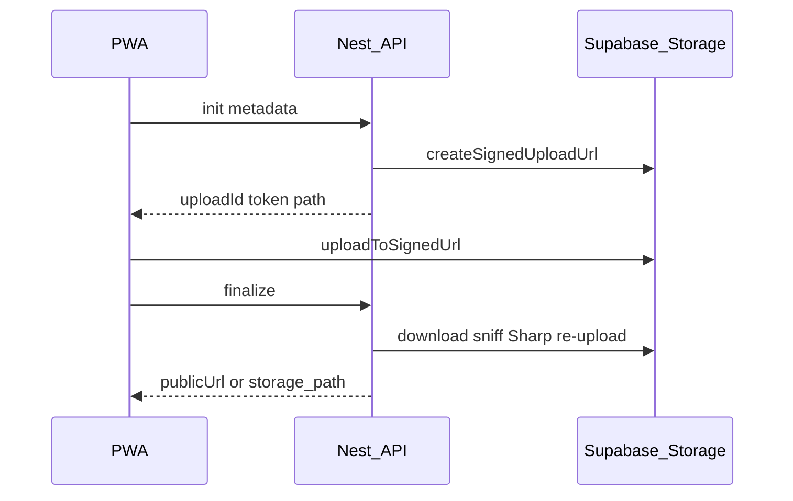

# File uploads and storage

User file writes use **direct-to-Supabase Storage** with server-minted signed upload URLs. The Nest API validates metadata, issues the URL, and finalizes after upload (magic-byte sniff + Sharp). The PWA must **not** call `supabase.storage.from(...).upload()` — only `uploadToSignedUrl` with tokens from Nest.

Cursor rule: [`.cursor/rules/security-storage.mdc`](../.cursor/rules/security-storage.mdc).

## Flow

1. PWA validates file locally (UX only): extension, MIME, size.
2. `POST /api/storage/uploads/init` — JSON metadata only (no file body).
3. PWA `uploadToSignedUrl(bucket, path, token, file)` via anon Supabase client.
4. `POST /api/storage/uploads/:uploadId/finalize` — server downloads object, sniffs MIME, re-encodes images, marks pending row completed.

## Upload types

| Type | Init `purpose` | Finalize response | Bucket |
|------|----------------|-------------------|--------|
| Job cover/extra | `job_photo` + `kind` | `publicUrl`, `storagePath` | `job-photos` |
| Profile avatar | `profile_avatar` | `publicUrl`, `storagePath` | `profile-avatars` |
| CV photo | `cv_photo` + `entityId` (cvId) | `storagePath` + `GET /api/cv/:id/photo-url` | `cv-photos` (private) |
| CV PDF (pre-rendered) | — (server Playwright on save) | `GET /api/cv/:id/pdf` | `cv-pdfs` (private) |
| Chat image/document | `chat_media` + `entityId` (roomId) | `storage_path`, `mime`, … | `chat-media` |
| Chat download | — | `GET /api/chat/rooms/:id/media-url` | `chat-media` |

Legacy multipart routes return **410 Gone**. CV JSON `data_url` on `POST /api/cv/:id/photo` remains for one release (buffer still hits API).

## Server pipeline (finalize)

1. Authenticate (`SessionAuthGuard` / `GlobalAuthGuard`) + ownership.
2. `@Throttle()` on init/finalize (~10/min).
3. Init: extension/MIME allowlist ([`file-allowlist.ts`](../backend-ts/src/storage/file-allowlist.ts)), size cap, server-generated path, `storage_pending_uploads` row.
4. Finalize: download object, **magic-byte sniff**, block SVG, Sharp for images, overwrite object with long `Cache-Control` (`storage-cache-policy.ts`).
5. Job photos: full image (max 1920px) plus list thumbnail `{uuid}_thumb.jpg` (640px) in the same bucket.
6. Pending registry: [`storage_pending_uploads`](../supabase/migrations/20260623140000_storage_pending_uploads.sql).

## Size and type limits

From [`backend-ts/src/storage/upload-policy.ts`](../backend-ts/src/storage/upload-policy.ts) (mirror [`app-pwa/utils/upload-policy.ts`](../app-pwa/utils/upload-policy.ts)):

| Kind | Max size | Max edge (images) | Types |
|------|----------|-------------------|-------|
| Job photo | 5 MB | 1920 px (640 px thumb for lists) | jpeg, png, webp, gif |
| Profile avatar | 5 MB | 512 px | jpeg, png, webp, gif |
| CV photo | 5 MB | 512 px | jpeg, png, webp |
| Chat media | 15 MB | (varies) | Images + PDF, Office, CSV, TXT, RTF, ODT, ODS |

Blocked: SVG, scripts, archives, double-extension tricks. See `BLOCKED_EXTENSIONS` in `file-allowlist.ts`.

## Public vs private access

| Bucket | Read | Write |
|--------|------|-------|
| `job-photos` | Public | Signed upload URL (service role mints token) |
| `profile-avatars` | Public | Signed upload URL |
| `cv-photos` | Short-lived signed URL via `GET /api/cv/:cvId/photo-url` (visibility/unlock) | Signed upload URL (service role only) |
| `cv-pdfs` | Nest streams bytes after auth (`GET /api/cv/:cvId/pdf`, employer routes) | Service role only (regenerated on CV save) |
| `chat-media` | Signed URL via Nest | Signed upload URL |

Legacy CV images may still exist under `profile-avatars/{user_id}/cv/…` until backfill; new uploads use `cv-photos`.

Bucket MIME enforcement: [`20260623140100_chat_media_mime_expand.sql`](../supabase/migrations/20260623140100_chat_media_mime_expand.sql).

## PWA usage

- [`useStorageUpload()`](../app-pwa/composables/useStorageUpload.ts) — init → `uploadToSignedUrl` → finalize.
- `validateStorageUploadMetadata` / `validateChatDocumentUpload` before init.
- Optional client compress via [`utils/image-compression.ts`](../app-pwa/utils/image-compression.ts).
- Never persist service role key in the client.

## Maintenance

- Hourly: stale `storage_pending_uploads` (`pending` > 2h) → `failed` + object remove ([`maintenance.cron.ts`](../backend-ts/src/maintenance/maintenance.cron.ts)).
- Weekly: orphan cleanup for `job-photos` and `profile-avatars`.

## Storage RLS migrations (hosted Supabase)

`storage.objects` is owned by `supabase_storage_admin`. On hosted projects the migration role **cannot** `DROP POLICY` (`42501 must be owner`) or `GRANT supabase_storage_admin` (reserved for superusers).

Lockdown migration [`20260628121000_storage_upload_lockdown_finish.sql`](../supabase/migrations/20260628121000_storage_upload_lockdown_finish.sql) adds **RESTRICTIVE** deny policies on `profile-avatars` and `chat-media` writes for `authenticated`. Legacy permissive write policies may still appear in the Dashboard but uploads are blocked; Nest uses `service_role` and is unaffected.

Optional Dashboard cleanup: delete obsolete permissive write policies on those buckets when the UI allows it.

## How to modify safely

1. Extend `file-allowlist.ts` + both `upload-policy.ts` files.
2. Add purpose handling in `StorageUploadService.initUpload` / `finalizeUpload`.
3. Update bucket `allowed_mime_types` migration if needed.
4. For storage write lockdown on hosted Supabase, prefer RESTRICTIVE deny policies (see above) instead of `DROP POLICY` from migrations.
5. Update this doc and [changelog.md](./changelog.md).
